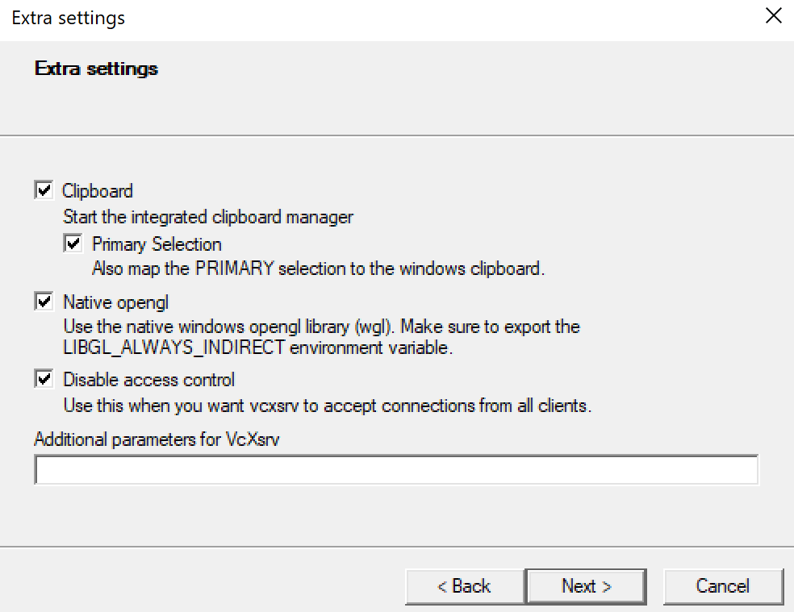

# Matplotlib Docker Windows Example

1. Install [VcXSrv](https://sourceforge.net/projects/vcxsrv/), launch, and configure per screenshots. 

2. Modify docker-compose.yml with your local ip from `ipconfig`

```yaml
environment:
  - DISPLAY=LocalIPHere(localhost will not work):0.0
```


3. In PyCharm:
```
Settings -> Tools -> Python Scientific 
-> DISABLE "Show plots in tool window"
```
```
Settings -> Project -> Python Interpreter -> Cog 
-> Plus -> Docker-Compose -> Select docker-compose.yml
```
```
Settings -> Project -> Path Mappings -> 
Local folder: Select Project Root
Remote folder: /mnt/src
```
~~Add Configuration -> Select test.py 
-> Enable "Run with Python Console" as per screenshot~~


4. (Maybe?) Allow `VcXSrv` through Windows Firewall.

VcXSrv Settings
---------------



